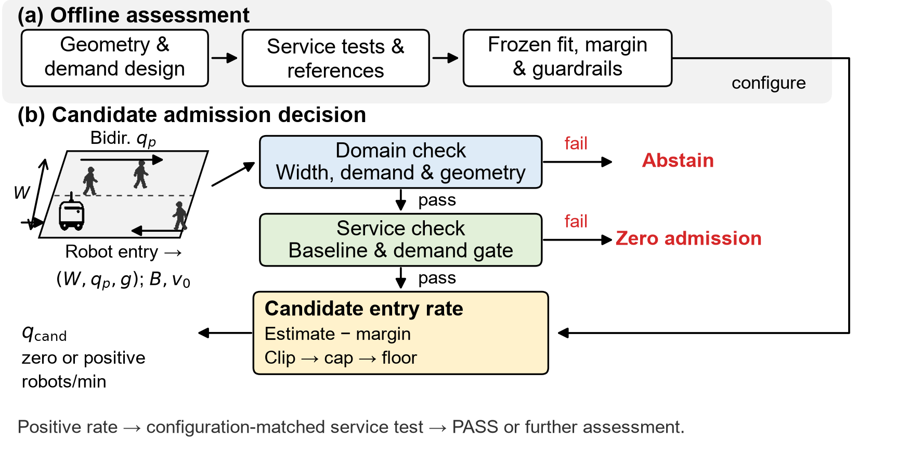
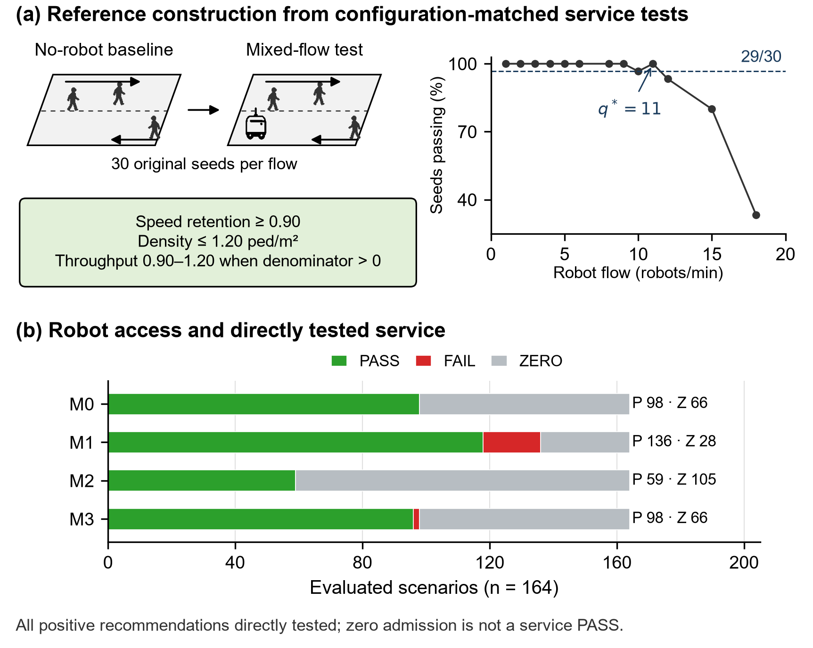

# Balancing Pedestrian Service and Robot Access

**An Interpretable Admission Framework for Sidewalk Delivery Robots**
An Xu and Yunfei Yin · Harbin Institute of Technology

**Submitted to [CICTP 2027](https://cictp2027.tsinghua.edu.cn/).** Submission status is reported by the authors; this does not claim acceptance.

[12-page paper](paper/ascexmpl-new.pdf) · [中文说明](README.zh-CN.md) · [Reproduce](docs/REPRODUCIBILITY.md) · [Research evolution](docs/RESEARCH_EVOLUTION.md) · [Final QA](docs/audits/FINAL_SUBMISSION_QA.md)

## Research question

Operating permission and fleet-size limits do not determine a robot entry rate for an individual sidewalk. We ask: **where can a rule be applied, what candidate rate does it offer, and how does pedestrian service perform at that rate?** Inputs are geometry and pedestrian demand; outputs distinguish abstention, zero admission and a positive candidate entry rate (robots/min).



The framework combines applicability checks, a pedestrian-service gate, a width–demand estimate, a conservative margin and fixed bounds. Positive recommendations are tested at their specified configuration and flow. They are not universal capacities or guarantees for every lower flow.

## Final results

The sample contains **400 scenarios / 140 cells / seven cities**. Common evaluation: **164 scenarios / 64 cells**. All positive recommendations were directly tested with seeds 0–29; zero admission is not a service pass.

| Method | Positive | Zero | PASS | FAIL | Median utilization |
|---|---:|---:|---:|---:|---:|
| M0 | 98 | 66 | 98 | 0 | 16.7% |
| M1 | 136 | 28 | 118 | 18 | 75.0% |
| M2 | 59 | 105 | 59 | 0 | 0.0% |
| M3 | 98 | 66 | 96 | 2 | 18.2% |

- **M0:** width–demand with margin; **M1:** without margin; **M2:** width-only with its own margin; **M3:** unconstrained width–demand with its own margin.
- Removing the margin creates **38 additional opportunities: 32 PASS, 6 FAIL**. In **98 common-positive scenarios**, M0 has **98 PASS/0 FAIL**, M1 **86 PASS/12 FAIL**; mean rates are **4.81 versus 7.55 robots/min**.
- Conservativeness lowers offered rates and removes access in some scenarios. Some withheld opportunities would pass.
- M3 is close to M0 in aggregate; this does **not** establish equivalence or no performance loss.
- Hong Kong separates **13 original / 5 entrance-repaired configurations**. Original M0: **7 PASS/0 FAIL**, M1: **10 PASS/1 FAIL**; repaired M0: **4 PASS/0 FAIL**, M1: **5 PASS/0 FAIL**. Zeros remain outside PASS counts.



Utilization is the median candidate/reference ratio over **139 positive-reference scenarios**, including zero recommendations and eight censored references. Service requires **29/30 seeds** satisfying speed retention ≥0.90, density ≤1.20 ped/m² and completed-trip ratio in [0.90, 1.20]. A zero denominator is undefined and fails that component.

## Research evolution

Early work emphasized a compact formula and reference-fit error. Evidence review shifted the question to **access, pedestrian service and applicability together**. Primary and independent seed blocks were separated, zero-denominator scoring corrected, and downstream calibration regenerated. Finally, **6 unique flow groups / 180 seed runs** were completed without changing final frozen recommendations. One further missing group was resolved from existing logs. **UNTESTED = 0**.

[The timeline](docs/RESEARCH_EVOLUTION.md) distinguishes historical results from the submitted analysis. The previous GitHub tree is preserved at commit `efc05fe`; it is not the authority for current numbers.

## Repository map

| Directory | Contents |
|---|---|
| `paper/` | Submitted PDF, LaTeX/BibTeX, three figures and generated tables |
| `src/sidewalk_admission/` | Portable candidate-rate rule and service test |
| `scripts/` | Verification, figures, paper build and single-run entry point |
| `configs/` | Frozen gates and 467 baseline/positive-flow specifications |
| `data/submission/` | References, parameters, predictions and seed evidence |
| `data/diagnostics/` | Exclusions, replication and sensitivity |
| `data/geometry/` | Development cells and Hong Kong polygon metadata |
| `code/` | Original simulator and historical analysis scripts |
| `docs/` | Evolution, reproducibility, data dictionary and audits |
| `tests/` | Service-boundary and exclusion checks |

## Quick verification

```bash
python -m pip install -r requirements.txt
python scripts/verify_results.py
python -m unittest discover -s tests
python scripts/build_figures_v2.py
python scripts/build_paper.py
```

Verification recomputes **1,600 recommendations**, **315 unique positive-flow tests** and **9,450 seed decisions**, without SUMO. Outputs go to ignored `outputs/`. Paper compilation needs LaTeX; exact figure typography uses Arial.

## Scope and data coverage

This simulation uses simplified interactions, specified regular demand, finite seeds and a finite flow scan. Hong Kong is geometry transfer, not field validation or a new blind test. Completed-trip counts are not actual model-entry throughput. The extreme M1 speed retention (0.071) is retained with its evidence audit.

Core code, paper, per-seed metrics, diagnostics, geometry and hashes are included. **Full trajectory/XML logs and external raw GIS archives are retained locally, not included in Git, and not deleted during cleanup.** [Data coverage](docs/DATA_DICTIONARY.md) distinguishes lightweight verification from full raw reconstruction.

No new blanket license is asserted for third-party data or the conference template. Existing source rights apply; contact the authors for permissions not explicitly granted.
