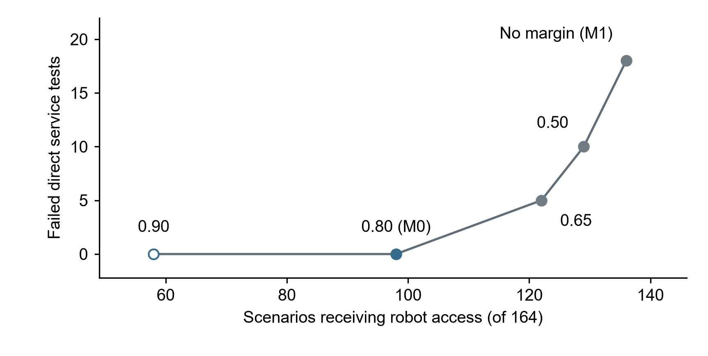

# Balancing Pedestrian Service and Robot Access

**An Interpretable Admission Framework for Sidewalk Delivery Robots**
An Xu and Yunfei Yin · Harbin Institute of Technology · CICTP2027 research version

How much robot traffic should an individual sidewalk admit while maintaining
acceptable pedestrian service? Operating permission and fleet size do not answer
that local allocation question. This research links sidewalk width and pedestrian
demand to an admission procedure: check applicability and baseline walking
service, offer a candidate rate with a conservative margin, then test that exact
rate under its stated configuration.

[Latest paper](paper_CICTP2027/manuscript/ascexmpl-new.pdf) ·
[CICTP data and methods](paper_CICTP2027/README.md) ·
[Reproduce](paper_CICTP2027/REPRODUCE.md) ·
[Historical versions](research_versions/README.md)

## Main findings

- On 164 evaluated scenarios, no-margin allocation offers 136 positive rates with 18
  failed service tests. The original 0.80 margin offers 98 rates with no observed
  failures. Stronger conservativeness can remove further access without improving
  the observed failure count.
- Of 38 opportunities withheld at 0.80, 32 pass their directly tested zero-margin
  rates. The margin therefore has an observable opportunity cost.
- Stratified independent-seed tests preserve13/13 M0 and 7/15 M1 positive decisions.
  This concerns selected conditions, not population-wide reliability.
- Transfer separates 13 original and five entrance-repaired Hong Kong
  configurations. Geometry, robot size and pedestrian direction affect assessment.



## Use the research record

```bash
python -m pip install -r paper_CICTP2027/requirements.txt
python -B paper_CICTP2027/scripts/reproduce.py
python -B paper_CICTP2027/scripts/build_assets.py
```

These commands reconstruct the main comparison, all five margin settings,
replication, failure decomposition, Hong Kong summaries, demand checks and
guardrail reconstruction from real archived evidence. SUMO is not needed for
numerical/figure reproduction. An explicitly invoked rerun interface uses the
frozen SUMO 1.27.1/JuPedSim protocol and preserves its outputs.

`paper_CICTP2027/` contains the current manuscript, compact seed evidence,
configuration templates and E1–E5 details. `research_versions/` preserves earlier
D2 and criterion-correction snapshots with distinct parameters. The root
`paper/`, `data/submission/`, code and original verification workflow remain the
19 September 2026 publication record; they are not silently replaced by the refined
manuscript. Original public README/citation records are also archived.

The service criterion describes walking speed, density and completed-record
balance, not collision safety or fulfillment of every scheduled arrival.
Coefficients/margins use training cities under fixed developed guardrails; the
complete architecture is not claimed as city-blind. See the
[data dictionary](paper_CICTP2027/DATA_DICTIONARY.md) and
[attribution/distribution scope](paper_CICTP2027/DATA_RIGHTS.md).
